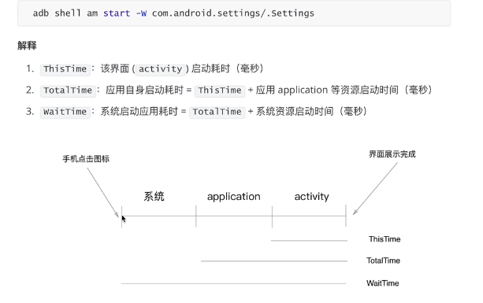

<!--
 * @Descripttion: 
 * @Author: zlj
 * @Date: 2020-06-02 13:54:43
 -->
# 常用命令

adb devices #查看连接设备

adb -s cf27456f shell # 指定连接设备使用命令

adb install test.apk # 安装应用

adb install -r demo.apk #安装apk 到sd 卡：

adb uninstall cn.com.test.mobile #卸载应用，需要指定包

adb uninstall -k cn.com.test.mobile #卸载app 但保留数据和缓存文件

adb shell pm list packages #列出手机装的所有app 的包名

adb shell pm list packages -3 #列出除了系统应用的第三方应用包名

adb shell pm clear cn.com.test.mobile #清除应用数据与缓存

adb shell am start -ncn.com.test.mobile/.ui.SplashActivity #启动应用

adb shell dumpsys package #包信息Package Information

adb shell dumpsys meminfo #内存使用情况Memory Usage

adb shell am force-stop cn.com.test.mobile #强制停止应用

adb logcat #查看日志

adb logcat -c #清除log 缓存

adb reboot #重启

adb start-server #启动adb服务端

adb kill-server #停止服务端

adb get-serialno #获取序列号

adb shell getprop ro.build.version.release #查看Android 系统版本

adb shell top -m 10 #查看占用内存前10 的app

adb push <local> <remote> #从本地复制文件到设备

adb pull <remote> <local> #从设备复制文件到本地

adb shell dumpsys window | grep mCurrentFocus #获取包名和界面名

adb bugreport #查看bug 报告

adb help #查看ADB 帮助

adb shell am start -W 包名/启动名 #获取app启动时间

